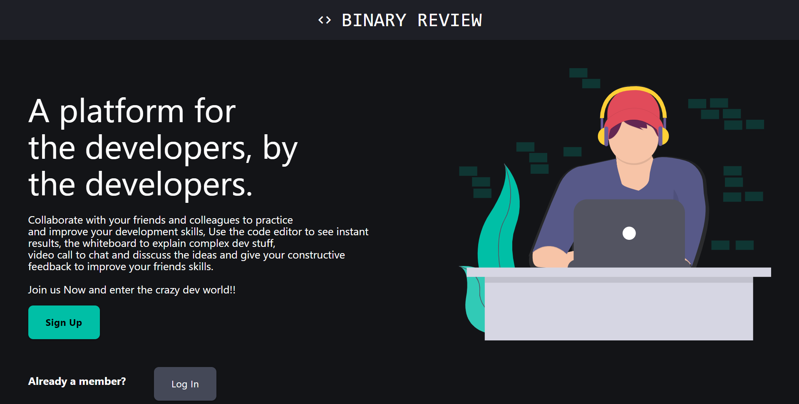
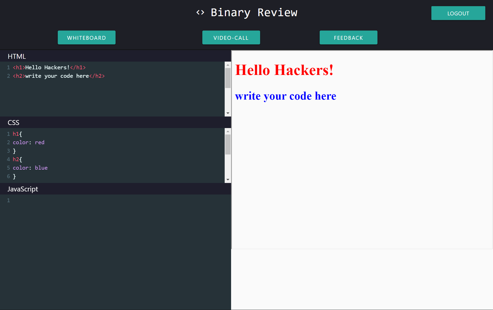
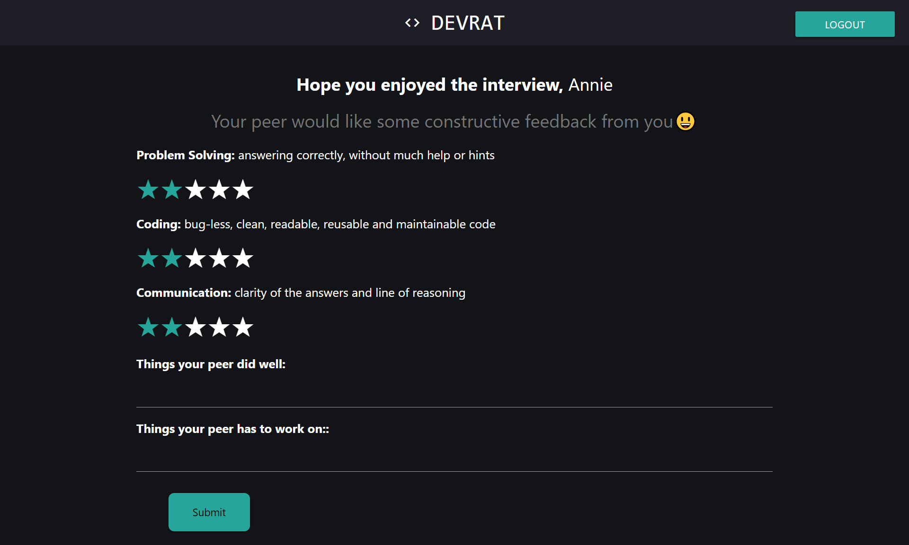

<h1 align="center">Hack36 Project- Binary Review</h1>

## Introduction:
A website to collaborate with your friends and colleagues to practice and improve your development skills, Use the code playground to show your peers instant outputs, the whiteboard to explain complex dev stuff, video call to chat and disscuss the ideas and feedback to give your constructive feedback to improve your friends skills.

  
## Demo Video Link:
  <a href="https://www.youtube.com/watch?v=8bPYbbDz0Vs">https://www.youtube.com/watch?v=8bPYbbDz0Vs</a>
  
## Presentation Link:
  <a href="https://docs.google.com/presentation/d/1-dKaUdjEq4fljhAV6PiofzM0wpS537OaEqXBinW7aO0/edit?usp=sharing">BINARY REVIEW PPT</a>
  

## Technology Stack:
  1) Node.JS
  2) React.JS
  3) Express
  4) Mongoose Framework
  

## Contributors:

Team Name: Devrath

* [Annie Saxena](https://github.com/anniesaxena)
* [Prateek Mehra](https://github.com/prateek-mehra)
* [Devrat Agarwal](https://github.com/DevratAgarwal)
* [Saumya Rajaura](https://github.com/shiv94124)

### Made at:

